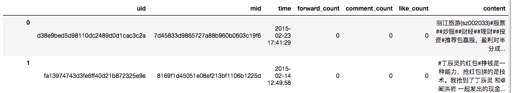
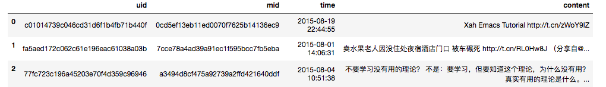
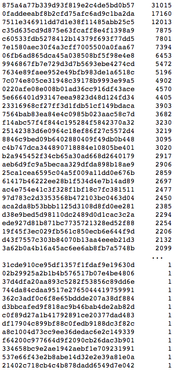
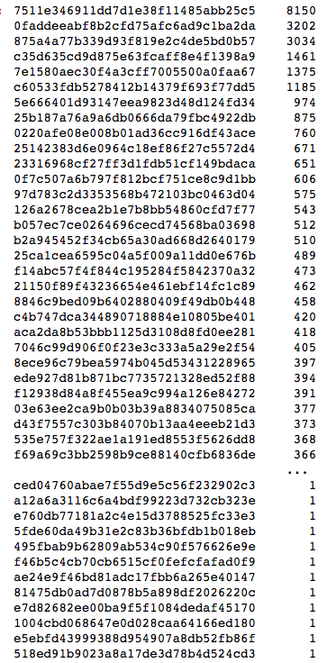
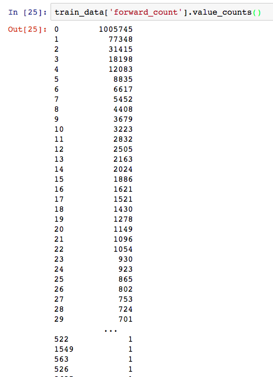
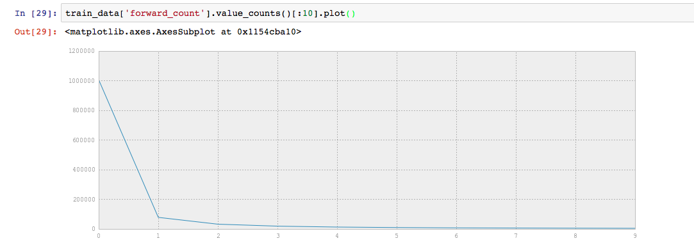
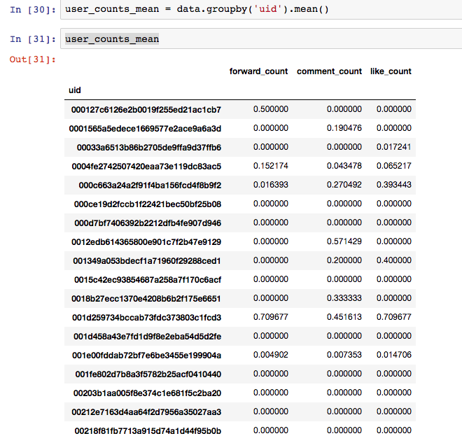

# 数据分析

训练集大小  :  1225088 rows × 7 columns

测试集大小 : 177923 rows × 4 columns  

微博总数: 1225088 + 177923 = 1403011

训练集：测试集 = 6.885 ： 1   近似 7：1

多少用户： train 37251,  test  17536

微博的转发数图    :    （可以看出绝大多数微博的转发数处于比较低的水平）

训练集每个用户的均值  ： 已经保存到文件

## 1 训练集

1225088 rows × 7 columns

## 2 测试集

177923 rows × 4 columns  

## 3 用户

train set

37251 

Test set

17536

## 4 训练集中微博转发数

可以看出绝大多数微博的转发数处于比较低的水平

## 5 训练集中每个用户的均值

